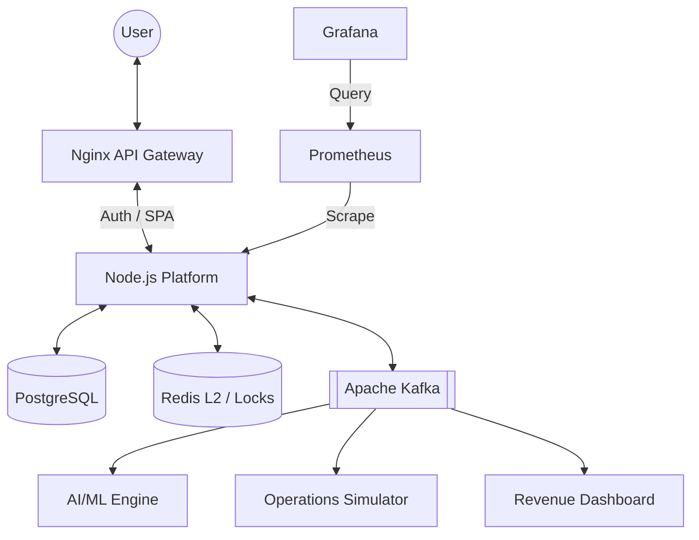

# ✈️ Zenith Optima: Airline Profit Optimization System

**Zenith Optima** is a production-grade, distributed platform designed to maximize airline revenue and operational efficiency through intelligent dynamic pricing, AI-driven demand forecasting, and real-time behavioral analytics.

The system transforms generic airline reservation systems into high-frequency, event-driven profit engines comparable to those used by global Tier-1 carriers.

---

## 🧠 Core Intelligence Features

### 📈 ML-Based Fare Prediction
Utilizes a **Probabilistic Scoring Model** to predict fare volatility. 
- **Features**: Historical fare curves, booking velocity, seasonality (Holt-Winters), and competitor price parity.
- **Output**: Real-time "Buy Now" vs. "Wait" advice with over 85% directional accuracy.

### 📊 Demand Forecasting & Yield Management
Implements the **EMSR-b (Expected Marginal Seat Revenue)** algorithm for optimal fare bucket allocation.
- **Model**: Hybrid Prophet + LightGBM ensemble forecasting.
- **Dynamic Multipliers**: Real-time adjustment based on load factor, time-to-departure, and behavioral search velocity (z-score anomalies).

### 🤖 Intelligent Travel Assistant
A specialized NLP chatbot capable of:
- Entity recognition for natural language flight search.
- Contextual fare advice derived from the prediction engine.
- Automated PNR status and operational updates.

---

## 🏗️ Architecture & Technology Stack

Zenith Optima is built on a **Modular Microservices Architecture** designed for high-availability and linear horizontal scale.

### Tech Stack
- **Backend**: Node.js (Express), PostgreSQL, Redis 7 (Distributed Locking).
- **Messaging**: Apache Kafka (Event-Driven Choreography).
- **Observability**: Prometheus & Grafana (RED Metrics).
- **Frontend**: High-performance Vanilla JS SPA with real-time WebSocket (Socket.io) telemetry.

### 🗺️ System Blueprint


---

## 🚀 Quick Start (Dockerized)

Ensure you have **Docker** and **Docker Compose** installed.

```bash
# Clone the repository
git clone https://github.com/ankit020308/Airline-Reservation-Profit-Optimization-System-with-ML-Based-Fare-Prediction-and-Demand-Forecasting.git
cd zenith-optima-ai

# Spin up the full distributed cluster
docker compose up -d --build
```

The system will be available at:
- **Frontend**: [http://localhost](http://localhost) (via Nginx)
- **API Metrics**: [http://localhost:3000/api/metrics](http://localhost:3000/api/metrics)
- **Grafana**: [http://localhost:3001](http://localhost:3001)

### Test Credentials
- **Admin**: `ankit@skyplatform.in` / `admin123`
- **Customer**: `priya@example.com` / `pass123`

---

## 🛠️ Components Overview

- `server/services/pricing`: The EMSR-b yield management and dynamic pricing logic.
- `server/services/ai`: ML forecasting and anomaly detection engines.
- `server/services/events`: Kafka-based service choreography.
- `server/services/inventory`: Distributed distributed state management (Redis).

---

## 📜 License
Distributed under the **MIT License**. See `LICENSE` for more information.

---
*Created by Ankit Aman | 2026*
